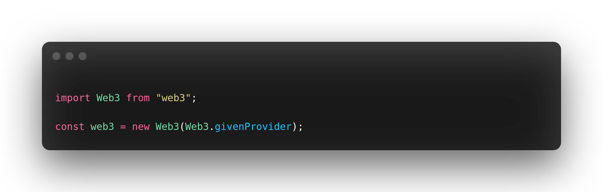
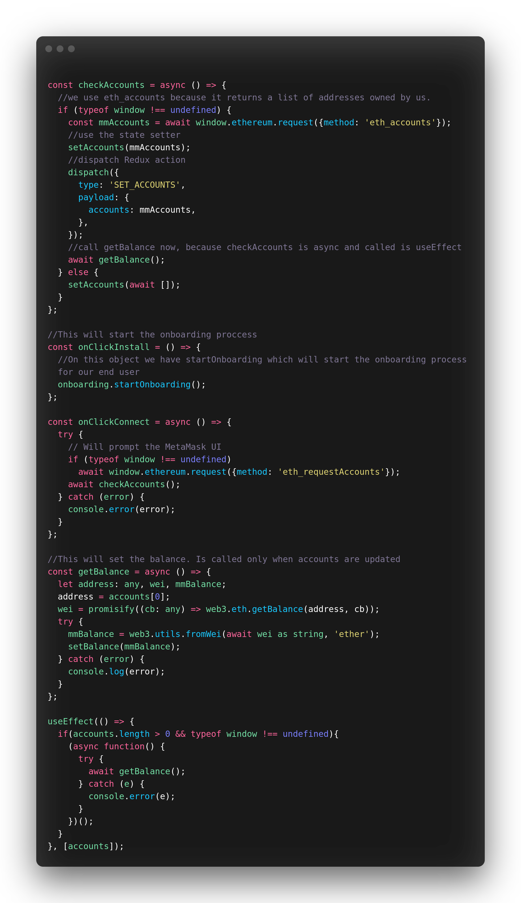
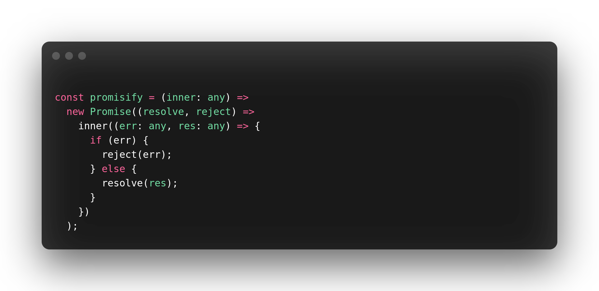
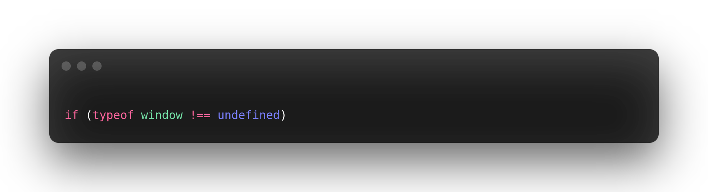

# Kiwi dApp

A training frontend project for `Tailwindcss`, `Web3` and `Metamask` integrations.

## Deploy your own

Deploy the example using [Vercel](https://vercel.com?utm_source=github&utm_medium=readme&utm_campaign=next-example)

## Demo

Click on the logo to test the demo deployed with 
[Vercel](https://vercel.com)

## Code Notes

#### Web3 usage

This is the way web3 is instantiated.  
Replace `givenProvider` by a custom RCP URI if needed.

#### Web3 Metamask setup

There are the main functions to setup for a minimal Metamask Onboarding.  
- Checking if the extension is installed
- Connect the user
- And get the accounts: address and balance

More documentation about Metamask Onboarding [here](https://docs.metamask.io/guide/create-dapp.html#basic-action-part-1).

#### promisify

Util function used to resolve and manage web3 Promises.

#### window + nextJs turnaround

NextJs uses SSR and SSG. While serving the frontend, on the SSR phase, there is no `window` element, like on a client's browser.  
Hence the turnaround.

## Dependencies

